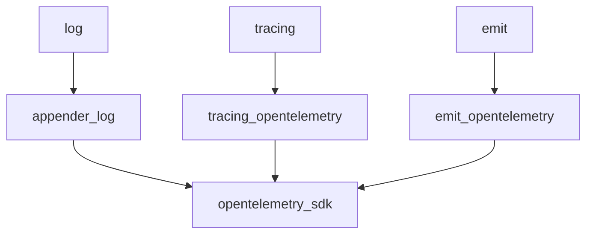

# Integrating with OpenTelemetry

You can configure `emit` to send its diagnostics to the OpenTelemetry SDK using [`emit_opentelemetry`](https://docs.rs/emit_opentelemetry). See [the crate docs](https://docs.rs/emit_opentelemetry) for more details.

Larger applications may find themselves integrating components using multiple diagnostic frameworks, like [`log`](https://docs.rs/log/latest/log/) or [`tracing`](https://docs.rs/tracing/latest/tracing/). In these cases, you can use the [OpenTelemetry SDK](https://github.com/open-telemetry/opentelemetry-rust) as your central pipeline, with others integrating with it instead of eachother.

Keep in mind that diagnostics from libraries you depend on aren't always useful or worth collecting. What the author of a library considers important isn't necessarily what you do in the context of your application. This is particularly true of tracing. If you don't control the code being traced, then any spans it produces are likely going to be noise that you can't meaningfully do anything with. Metrics can be an exception. They typically boil down the behavior of a component into a few key indicators that can give you a good idea of what it's doing, without bloating your own diagnostics.
