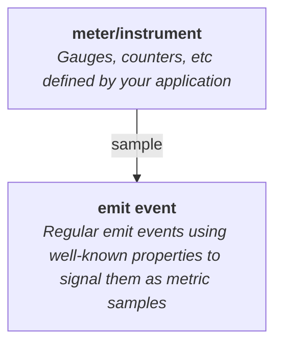

# Metrics

Metrics are an effective approach to monitoring applications at scale. They can be cheap to collect, making them suitable for performance sensitive operations. They can also be compact to report, making them suitable for high-volume scenarios.

`emit` doesn't provide its own definitions of _meters_ or _instruments_, types like gauges and counters that you can set or increment. The way you track metrics in your application will depend on what kind of application it is, so it's up to you to decide how you want to do this.

What `emit` does provide is a standard way to report metric samples you collect as events through its runtime:



Emitters that are metric-aware, like [`emit_otlp`](../emitting-events/otlp.md), can then handle those samples differently from regular events.

A standard kind of metric is a monotonic counter, which can be represented as an atomic integer. In this example, our counter is for the number of bytes written to a file, which we'll call `bytes_written`. We can report a sample of this counter as an event using some [well-known properties](./metrics/data-model.md):

```rust
# extern crate emit;
# fn sample_bytes_written() -> usize { 4643 }

let sample = sample_bytes_written();

emit::emit!(
    "{metric_agg} of {metric_name} is {metric_value}",
    evt_kind: "metric",
    metric_agg: "count",
    metric_name: "bytes_written",
    metric_value: sample,
);
```


```text
Event {
    mdl: "my_app",
    tpl: "{metric_agg} of {metric_name} is {metric_value}",
    extent: Some(
        "2024-04-29T10:08:24.780230000Z",
    ),
    props: {
        "evt_kind": metric,
        "metric_name": "bytes_written",
        "metric_agg": "count",
        "metric_value": 4643,
    },
}
```

To learn more about `emit`'s macro syntax, see [Template syntax and rendering](../reference/templates.md).

-----


_A metric produced by [this example application](https://github.com/emit-rs/emit/tree/main/examples/metric_prometheus) in Prometheus._
