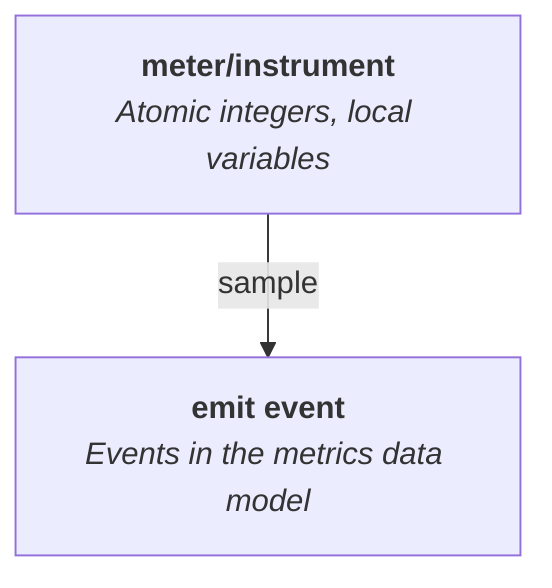
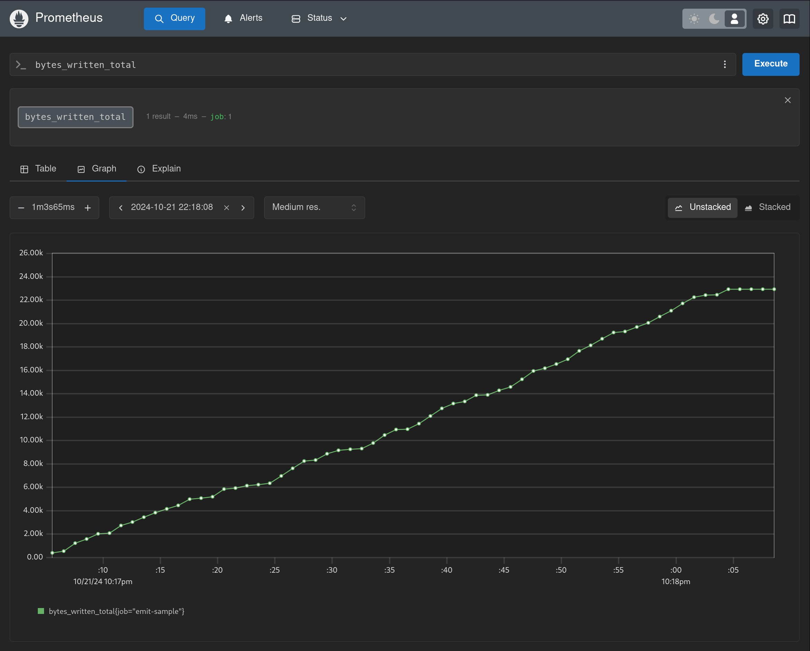

# Metrics

Metrics are an effective approach to monitoring applications at scale. They can be cheap to collect, making them suitable for performance sensitive operations. They can also be compact to report, making them suitable for high-volume scenarios.

`emit` doesn't provide its own definitions of types like gauges and counters that you can set or increment. The way you define, store, and track metrics in your application will depend on your specific needs. `emit` becomes involved at the point you want to send samples you collect of your metrics to external systems. It does this by representing the values you sample as events with well-known properties:



Emitters that are metric-aware, like [`emit_otlp`](../emitting-events/otlp.md), can then handle those samples differently from regular events.

## The `sample!` macro

In `emit`, metric samples are events that represent an aggregation of their underlying source into a value at a particular point in time, or over a particular time range. These samples can be constructed and emitted using the [`sample!`](https://docs.rs/emit/1.15.0/emit/macro.sample.html) macro.

A standard kind of metric is a monotonic counter, which can be represented as an atomic integer. In this example, our counter is for the number of bytes written to a file, which we'll call `bytes_written`. We can report a sample of this counter:

```rust
# extern crate emit;
# fn sample_bytes_written() -> usize { 4643 }

// `sample_bytes_written` is an application-specific method to read your metric values
let bytes_written: usize = sample_bytes_written();

// The `sample!` macro wraps the sample into an event and emits it through the diagnostic pipeline
emit::sample!(value: bytes_written, agg: "count");
```

```text
Event {
    mdl: "my_app",
    tpl: "{metric_agg} of {metric_name} is {metric_value}",
    extent: Some(
        "2024-04-29T10:08:24.780230000Z",
    ),
    props: {
        "evt_kind": metric,
        "metric_name": "bytes_written",
        "metric_agg": "count",
        "metric_value": 4643,
    },
}
```

Note that the type of a sample value isn't required to be an integer as in the previous example. It can be any value, including floating points, booleans, strings, and objects. It's best to stick to numeric types though for the broadest compatibility.

`emit` also defines macros for producing metric samples for specific aggregations:

- [`count_sample!`](https://docs.rs/emit/1.15.0/emit/macro.count_sample.html) for samples of a monotonic counter.
- [`sum_sample!`](https://docs.rs/emit/1.15.0/emit/macro.sum_sample.html) for samples of a non-monotonic sum.
- [`min_sample!`](https://docs.rs/emit/1.15.0/emit/macro.min_sample.html) for samples of the minimum observed value.
- [`max_sample!`](https://docs.rs/emit/1.15.0/emit/macro.max_sample.html) for samples of the maximum observed value.
- [`last_sample!`](https://docs.rs/emit/1.15.0/emit/macro.last_sample.html) for samples of the latest value.

-----



_A metric produced by [this example application](https://github.com/emit-rs/emit/tree/main/examples/metric_prometheus) in Prometheus._
