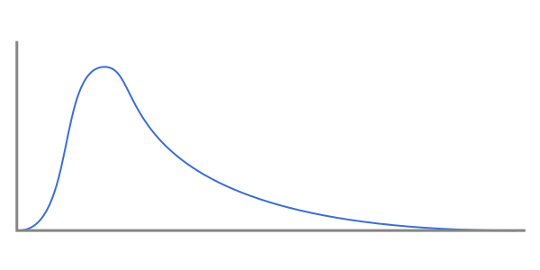

# Distributions

Distributions are an optional extension to metric samples that tell you more about the underlying data that produced them. Properties with a `dist_` prefix describe the data that contributed to a sample in more detail. Each of these properties is optional.

Emitters that are distribution-aware may treat events that carry them differently. [`emit_otlp`](../../emitting-events/otlp.md) treats samples carrying an [exponential histogram](#exponential-histograms) as an [OTLP exponential histogram](https://opentelemetry.io/docs/specs/otel/metrics/data-model/#exponentialhistogram). [`emit_term`](../../emitting-events/console.md) summarizes these same samples with [quartiles](https://en.wikipedia.org/wiki/Quartile).

## Sums and extrema

Say we have the following metric sample:

```rust
# extern crate emit;
emit::count_sample!(name: "http_response", value: 500);
```

This tells us we've seen 500 values, but doesn't tell us anything about those 500 values themselves.

Attaching the sum of values with `dist_sum` gives us some more information:

```rust
# extern crate emit;
emit::count_sample!(
    name: "http_response",
    value: 500,
    props: emit::props! {
        dist_sum: 1689628,
    },
);
```

With both the sum and the count, we can compute the mean as `3379.256`.

The mean gives us a central point for the dataset, but the same mean could come from very different bounds.

Attaching the extrema with `dist_min` and `dist_max` further tells us what the range of values is:

```rust
# extern crate emit;
emit::count_sample!(
    name: "http_response",
    value: 500,
    props: emit::props! {
        dist_sum: 1689628,
        dist_min: 100,
        dist_max: 29046,
    }
);
```

### Sum and extrema data model

Each well-known metric aggregation (the value of `metric_agg`) has a corresponding `dist_{metric_agg}`. The type and semantics of distribution properties is the same as their aggregation.

### Distribution properties vs separate metrics

The `dist_sum`, `dist_count`, `dist_min`, and `dist_max` properties each have a corresponding value for `metric_agg`. For example, if we take the final sample from earlier we could split it into 4 individual samples instead:

```rust
# extern crate emit;
emit::count_sample!(name: "http_response", value: 500);
emit::sum_sample!(name: "http_response", value: 1689628);
emit::min_sample!(name: "http_response", value: 100);
emit::max_sample!(name: "http_response", value: 29046);
```

The difference between these two representations is whether those individual samples are valuable in their own right. Emitters may ignore distribution properties, so if you want to track that aggregation, then prefer separate samples.

## Exponential histograms

A histogram is a compression of the underlying data source that buckets nearby values together and counts them, rather than storing the raw values themselves. Histograms give you an idea of how values are distributed across their range.

An exponential histogram automatically sizes its buckets using an exponential function, so buckets closer to zero are smaller (more accurate) than buckets further away from zero. They're good for _light-tail_ distributions, where values are clustered near the front and extremes are rare. Light-tail distributions have roughly this shape:



Typical web request latencies follow this shape. Most requests for a given endpoint complete around the same time, but in rare circumstances they may take much longer.

`emit` supports attaching an exponential histogram to a metric sample with the `dist_exp_scale` and `dist_exp_buckets` properties:

```rust
# extern crate emit;
emit::count_sample!(
    name: "http_response",
    value: 500,
    props: emit::props! {
        dist_sum: 1689628,
        dist_min: 100,
        dist_max: 29046,
        dist_exp_scale: 2,
        // Buckets have a complex type so need to be captured with
        // either `serde` or `sval`
        #[emit::as_sval]
        dist_exp_buckets: [
            (99.07220457217667, 7),
            (117.81737057623761, 7),
            (140.10925536017402, 7),
            (166.61892335205206, 7),
            (198.14440914435335, 6),
            (235.63474115247521, 6),
            (280.218510720348, 9),
            (333.2378467041041, 9),
            (396.2888182887066, 12),
            (471.2694823049503, 11),
            (560.4370214406958, 13),
            (666.475693408208, 13),
            (792.5776365774132, 15),
            (942.5389646099006, 19),
            (1120.8740428813917, 24),
            (1332.951386816416, 24),
            (1585.1552731548263, 20),
            (1885.0779292198008, 21),
            (2241.748085762783, 32),
            (2665.9027736328317, 37),
            (3170.3105463096517, 28),
            (3770.1558584396016, 34),
            (4483.496171525566, 27),
            (5331.8055472656615, 34),
            (6340.621092619303, 34),
            (7540.311716879201, 19),
            (8966.99234305113, 5),
            (10663.611094531323, 2),
            (12681.242185238603, 2),
            (15080.623433758403, 4),
            (21327.222189062646, 3),
            (25362.484370477203, 8),
            (30161.2468675168, 1),
        ],
    }
);
```

### Exponential histogram data model

`emit`'s exponential histograms are a pair of well-known properties:

- `dist_exp_scale`: An integer with the scale of the histogram.
- `dist_exp_buckets`: A 2-dimensional sequence of bucket midpoints and counts. The sequence may be constructed from an array of 2-element tuples, or a map where the keys are bucket midpoints and the values are counts. Buckets have a complex type, so need to be captured using either the [`as_serde`](https://docs.rs/emit/1.17.1/emit/attr.as_serde.html) or [`as_sval`](https://docs.rs/emit/1.17.1/emit/attr.as_sval.html) attributes. See [Property Capturing](../../reference/property-capturing.md) for more details.

### Building exponential histograms

`emit` doesn't directly define a type that builds an exponential histogram for you. What it does provide is the [`midpoint`](https://docs.rs/emit/1.17.1/emit/metric/exp/fn.midpoint.html) function, returning a [`Point`](https://docs.rs/emit/1.17.1/emit/metric/exp/struct.Point.html) that can be stored in a `BTreeMap` or `HashMap`.

Here's an example type that can collect an exponential histogram from raw values:

```rust
# extern crate emit;
use std::collections::BTreeMap;

struct MyDistribution {
    scale: i32,
    max_buckets: usize,
    total: u64,
    buckets: BTreeMap<emit::metric::exp::Point, u64>,
}

impl MyDistribution {
    pub fn new() -> Self {
        MyDistribution {
            // Pick a large initial scale, we'll resample automatically
            // when the number of stored buckets overflows `max_buckets`
            scale: 20,
            max_buckets: 160,
            total: 0,
            buckets: BTreeMap::new(),
        }
    }

    pub fn buckets(&self) -> &BTreeMap<emit::metric::exp::Point, u64> {
        &self.buckets
    }

    pub fn total(&self) -> u64 {
        self.total
    }

    pub fn scale(&self) -> i32 {
        self.scale
    }

    pub fn observe(&mut self, value: f64) {
        *self
            .buckets
            .entry(emit::metric::exp::midpoint(value, self.scale))
            .or_default() += 1;

        self.total += 1;

        // If we've overflowed then reduce our scale and resample
        // Each time `scale` is decremented, our number of buckets will be halved
        if self.buckets.len() >= self.max_buckets {
            self.scale -= 1;

            let mut resampled = BTreeMap::new();

            for (value, count) in &self.buckets {
                *resampled
                    .entry(emit::metric::exp::midpoint(value.get(), self.scale))
                    .or_default() += *count;
            }

            self.buckets = resampled;
        }
    }
}
```

An exponential histogram in `MyDistribution` can then be converted into a metric sample:

```rust
# extern crate emit;
# #[derive(Default)]
# struct MyDistribution {
#     scale: i32,
#     max_buckets: usize,
#     total: u64,
#     buckets: std::collections::BTreeMap<emit::metric::exp::Point, u64>,
# }
# impl MyDistribution {
#     pub fn buckets(&self) -> &std::collections::BTreeMap<emit::metric::exp::Point, u64> { &self.buckets }
#     pub fn total(&self) -> u64 { self.total }
#     pub fn scale(&self) -> i32 { self.scale }
# }
# let my_distribution = MyDistribution::default();
emit::count_sample!(
    name: "http_response",
    value: my_distribution.total(),
    props: emit::props! {
        dist_exp_scale: my_distribution.scale(),
        #[emit::as_sval]
        dist_exp_buckets: my_distribution.buckets(),
    },
);
```

### How exponential histograms work

Exponential histograms internally use γ, a value close to `1`, as a log base for computing the bucket a sample belongs to.

`emit` uses the same scheme as OpenTelemetry for computing γ from a parameter called `scale`, which is an integer typically between `0` and `20`. The [`midpoint`](https://docs.rs/emit/1.17.1/emit/metric/exp/fn.midpoint.html) function does this for you. Computing from `scale` has the benefit of _perfect subsetting_, where each decrement of the scale exactly halves the number of buckets. This makes it possible to resample or merge histograms with different scales without needing to interpolate any buckets.

The sections below outline the equations involved in building and interpreting exponential histograms.

#### Computing γ

γ is a value close to `1` used as a log base for computing the bucket a sample belongs to. `emit` and OpenTelemetry compute γ from an integral `scale` parameter. DDSketch uses a parameter called α (also called `error`) to compute the same γ, but slightly differently.

From `scale`:

\\[ γ = 2^{2^{-scale}} \\]

From `error`:

\\[ γ = \frac{1 + error}{1 - error} \\]

#### Computing `index`

The index is the bucket that a value belongs to. Values that are close together will share the same bucket.

\\[ index = \lceil{\log_γ (\lvert{value}\rvert)}\rceil \\]

#### Computing `midpoint`

The midpoint is a value at the center of a bucket index.

\\[ midpoint = \frac{γ^{index - 1} + γ^{index}}{2} \\]

#### Rescaling

If you have a scale and range of bucket indexes, you can compute a new scale that fits them into a target maximum number of buckets.

\\[ scale_1 = scale_0 - \lceil{\log_2 \left({\frac{index_{max} - index_{min}}{size}}\right)}\rceil \\]

#### Computing `error` from `scale`

If you have a scale, you can compute the error value from it, which gives you an idea of how accurate bucket values are. The error is slightly misleading because it's a percentage rather than an absolute value. Larger values can be further from their midpoint than smaller ones.

\\[ error = \frac{2^{2^{-scale}} - 1}{2^{2^{-scale}} + 1} \\]
