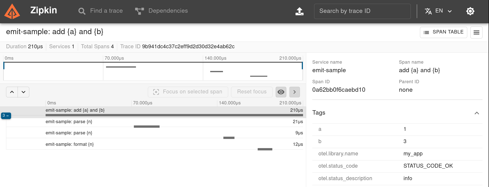

# Tracing

When your application executes key operations, you can emit span events that cover the time they were active. Any other operations involved in that execution, or any other events emitted during it, will be correlated through identifiers to form a hierarchical call tree. Together, these events form a trace, which in distributed systems can involve operations executed by other services. Traces are a useful way to build a picture of service dependencies in distributed applications, and to identify performance problems across them.

## The `#[span]` macro

`emit` supports tracing operations through attribute macros on functions. These macros use the same syntax as those for emitting regular events:

```rust
# extern crate emit;
#[emit::span("wait a bit", sleep_ms)]
fn wait_a_bit(sleep_ms: u64) {
    std::thread::sleep(std::time::Duration::from_millis(sleep_ms))
}

wait_a_bit(1200);
```

```text
Event {
    mdl: "my_app",
    tpl: "wait a bit",
    extent: Some(
        "2024-04-27T22:40:24.112859000Z".."2024-04-27T22:40:25.318273000Z",
    ),
    props: {
        "evt_kind": span,
        "span_name": "wait a bit",
        "span_id": 71ea734fcbb4dc41,
        "trace_id": 6d6bb9c23a5f76e7185fb3957c2f5527,
        "sleep_ms": 1200,
    },
}
```

When the annotated function returns, a span event for its execution is emitted. The extent of a span event is a range, where the start is the time the function began executing, and the end is the time the function returned.

Asynchronous functions are also supported:

```rust
# extern crate emit;
# async fn sleep<T>(_: T) {}
# async fn _main() {
#[emit::span("wait a bit", sleep_ms)]
async fn wait_a_bit(sleep_ms: u64) {
    sleep(std::time::Duration::from_millis(sleep_ms)).await
}

wait_a_bit(1200).await;
# }
```

To learn more about `emit`'s macro syntax, see [Template syntax and rendering](../reference/templates.md).

## Spans with levels

`emit` also defines macros for emitting spans at different levels for filtering:

- [`#[debug_span]`](https://docs.rs/emit/1.8.1/emit/attr.debug_span.html)
- [`#[info_span]`](https://docs.rs/emit/1.8.1/emit/attr.info_span.html)
- [`#[warn_span]`](https://docs.rs/emit/1.8.1/emit/attr.warn_span.html)
- [`#[error_span]`](https://docs.rs/emit/1.8.1/emit/attr.error_span.html)

The level of a span may also depend on its execution. See [Fallible functions](./tracing/fallible-functions.md) and [Manual span completion](./tracing/manual-span-completion.md) for details.

-----



_A trace produced by [this example application](https://github.com/emit-rs/emit/tree/main/examples/trace_zipkin) in Zipkin._
