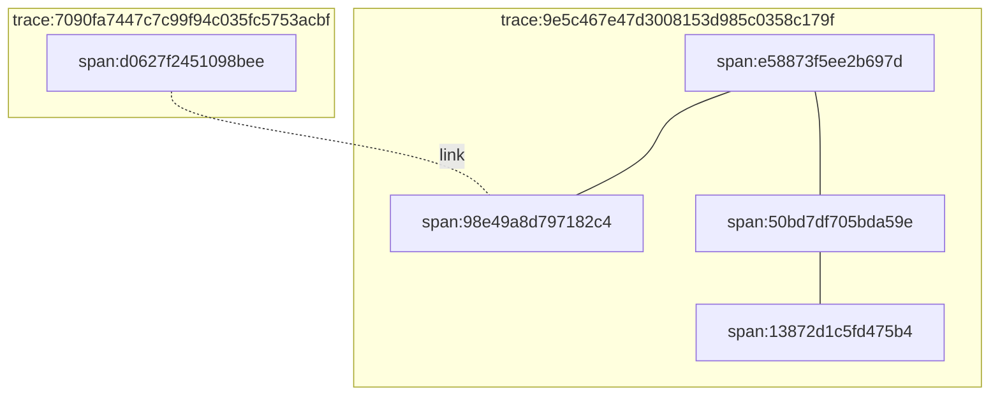

# Span links

Spans within a trace are linked by a single parent-child relationship. Each span may have any number of child spans that it causes within the same trace, but each child span may only have a single parent. The resulting trace can be expressed as a _tree_, which is a specific kind of graph. Span links make it possible to describe relationships between spans that can't be represented in a tree, and to link spans in different traces.

Here's an example of a link between two spans in different traces:



In this example, the link on span `d0627f2451098bee` is to the span `98e49a8d797182c4` in a different trace.

In `emit`, span links are expressed through the `span_links` [well-known property](https://docs.rs/emit/1.15.0/emit/well_known/index.html) as a sequence of formatted strings, or a sequence of the [`SpanLink`](https://docs.rs/emit/1.15.0/emit/span/struct.SpanLink.html) type:

```rust
# extern crate emit;
#[emit::span(
    "wait a bit",
    sleep_ms,
    #[emit::as_serde]
    span_links: [
        "0a85ccaf666e11aaca6bd5d469e2850d-2b9caa35eaefed3a",
    ],
)]
fn wait_a_bit(sleep_ms: u64) {
    std::thread::sleep(std::time::Duration::from_millis(sleep_ms));

    emit::emit!("waiting a bit longer");

    std::thread::sleep(std::time::Duration::from_millis(sleep_ms));
}
```

Since the expected type of `span_links` is a sequence, you'll need to use either the [`#[as_serde]`](../../reference/property-attributes.md#as_serde) or [`#[as_sval]`](../../reference/property-attributes.md#as_sval) attributes to capture them.

In this example, the span link is a constant string. You can avoid allocating strings at runtime for links by using the [`SpanLink`](https://docs.rs/emit/1.15.0/emit/span/struct.SpanLink.html) type instead:

```rust
# extern crate emit;
#[emit::span("wait a bit", sleep_ms)]
fn wait_a_bit(sleep_ms: u64) {
    std::thread::sleep(std::time::Duration::from_millis(sleep_ms));

    emit::emit!("waiting a bit longer");

    std::thread::sleep(std::time::Duration::from_millis(sleep_ms));
}

// Create a span link, possibly from some incoming trace state on a messaging queue
let link = emit::span::SpanLink::new(
    emit::span::TraceId::from_u128(0x1).unwrap(),
    emit::span::SpanId::from_u64(0x1).unwrap(),
);

// Push the link onto ambient context so it'll get picked up by the span
// created by the `wait_a_bit` call
let frame = emit::Frame::push(
    emit::ctxt(),
    emit::props! {
        #[emit::as_serde]
        span_links: [
            link,
        ]
    },
);

frame.call(|| {
    wait_a_bit(100);
});
```
