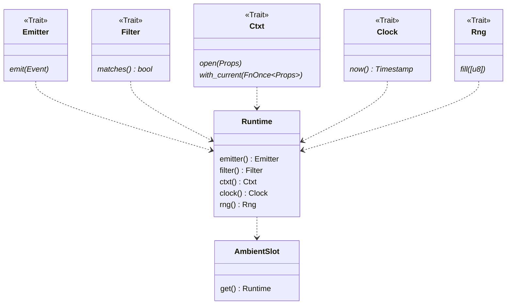

# Architecture

```mermaid
classDiagram
    class AmbientSlot {
        get() Runtime
    }

    Runtime ..> AmbientSlot

    class Runtime {
        emitter() Emitter
        filter() Filter
        ctxt() Ctxt
        clock() Clock
        rng() Rng
    }

    Emitter ..> Runtime
    Filter ..> Runtime
    Ctxt ..> Runtime
    Clock ..> Runtime
    Rng ..> Runtime

    class Emitter {
        emit(Event)*
    }

    <<Trait>> Emitter

    class Filter {
        matches() bool*
    }

    <<Trait>> Filter

    class Ctxt {
        open(Props)*
        with_current(FnOnce~Props~)*
    }

    <<Trait>> Ctxt

    class Clock {
        now() Timestamp*
    }

    <<Trait>> Clock

    class Rng {
        fill([u8])*
    }

    <<Trait>> Rng

    click Emitter href "https://docs.rs/emit/0.11.0-alpha.17/emit/trait.Emitter.html"
    click Filter href "https://docs.rs/emit/0.11.0-alpha.17/emit/trait.Filter.html"
    click Ctxt href "https://docs.rs/emit/0.11.0-alpha.17/emit/trait.Ctxt.html"
    click Clock href "https://docs.rs/emit/0.11.0-alpha.17/emit/trait.Clock.html"
    click Rng href "https://docs.rs/emit/0.11.0-alpha.17/emit/trait.Rng.html"
    click Runtime href "https://docs.rs/emit/0.11.0-alpha.17/emit/runtime/struct.Runtime.html"
    click AmbientSlot href "https://docs.rs/emit/0.11.0-alpha.17/emit/runtime/struct.AmbientSlot.html"
```

`emit_core` -> `emit_macros` -> `emit` -> `emit_term`, `emit_file`, `emit_otlp`
