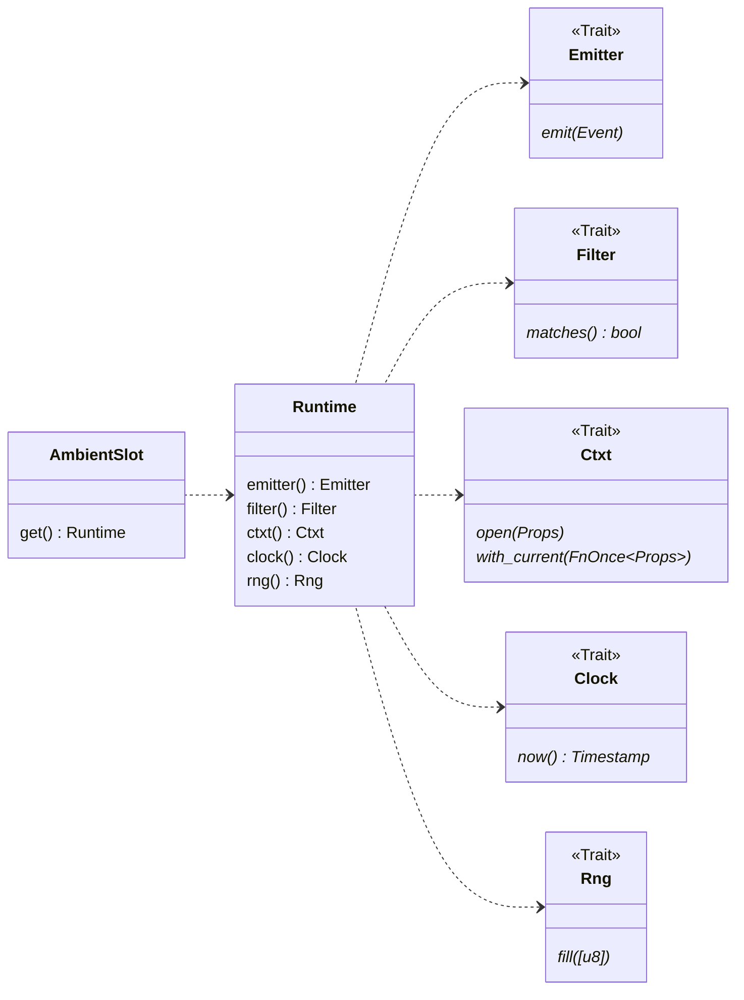
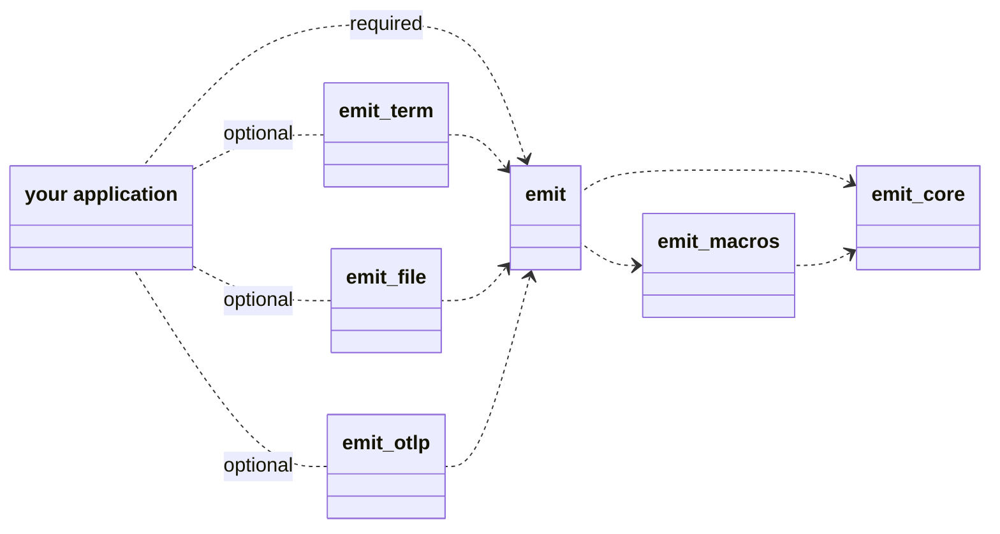

# Architecture

This section describes `emit`'s key components and how they fit together.

In `emit`, a diagnostic pipeline is an instance of a [`Runtime`](https://docs.rs/emit/0.11.0-alpha.17/emit/runtime/struct.Runtime.html). Each runtime is an isolated set of components that help construct and emit diagnostic events in your applications. It looks like this:

A [`Runtime`](https://docs.rs/emit/0.11.0-alpha.17/emit/runtime/struct.Runtime.html) includes:

- [`Emitter`](https://docs.rs/emit/0.11.0-alpha.17/emit/trait.Emitter.html): Responsible for sending events to some outside observer.
- [`Filter`](https://docs.rs/emit/0.11.0-alpha.17/emit/trait.Filter.html): Responsible for determining whether an event should be emitted or not.
- [`Ctxt`](https://docs.rs/emit/0.11.0-alpha.17/emit/trait.Ctxt.html): Responsible for storing ambient context that's appended to events as they're constructed.
- [`Clock`](https://docs.rs/emit/0.11.0-alpha.17/emit/trait.Clock.html): Responsible for assigning timestamps to events and running timers.
- [`Rng`](https://docs.rs/emit/0.11.0-alpha.17/emit/trait.Rng.html): Responsible for generating unique identifiers like trace and span ids.

An [`AmbientSlot`](https://docs.rs/emit/0.11.0-alpha.17/emit/runtime/struct.AmbientSlot.html) is a container for a `Runtime` that manages global initialization. `emit` includes two built-in ambient slots:

- [`shared()`](https://docs.rs/emit/0.11.0-alpha.17/emit/runtime/fn.shared_slot.html): The runtime used by default when not otherwise specified.
- [`internal()`](https://docs.rs/emit/0.11.0-alpha.17/emit/runtime/fn.internal_slot.html): The runtime used by other runtimes for self diagnostics.

You can also define your own `AmbientSlot`s or use `Runtime`s directly.

See [Events](./events.md) for details on how these components are used to construct and consume events.

## Crate organization

`emit` is split into a few subcrates:

- [`emit_core`](https://docs.rs/emit_core/0.11.0-alpha.17/emit_core/index.html): The fundamental APIs needed to define runtimes. It includes the `shared()` and `internal()` runtimes.
- [`emit_macros`](https://docs.rs/emit_macros/0.11.0-alpha.17/emit_macros/index.html): The `emit::emit!` and `#[emit::span]` macros.
- [`emit`](https://docs.rs/emit/0.11.0-alpha.17/emit/index.html): The main library that re-exports `emit_core` and `emit_macros`. This is the one your applications depend on.

`emit` doesn't implement any emitters itself, but does provide a few additional libraries that do:

- [`emit_term`](https://docs.rs/emit_term/0.11.0-alpha.17/emit_term/index.html): Writes to the console.
- [`emit_file`](https://docs.rs/emit_file/0.11.0-alpha.17/emit_file/index.html): Writes to rolling files.
- [`emit_otlp`](https://docs.rs/emit_otlp/0.11.0-alpha.17/emit_otlp/index.html): Writes OpenTelemetry's wire protocol.
