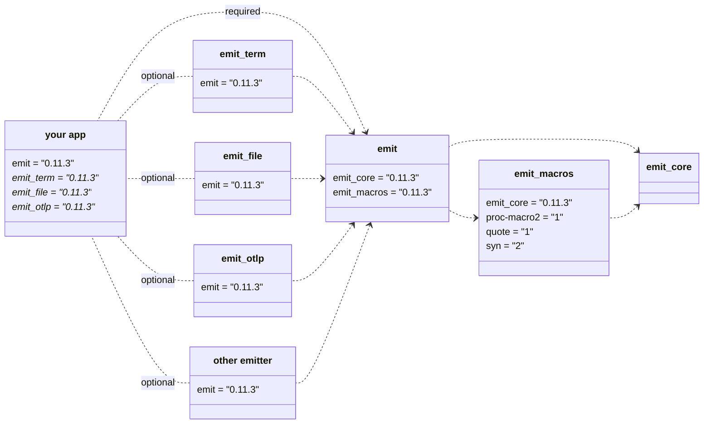
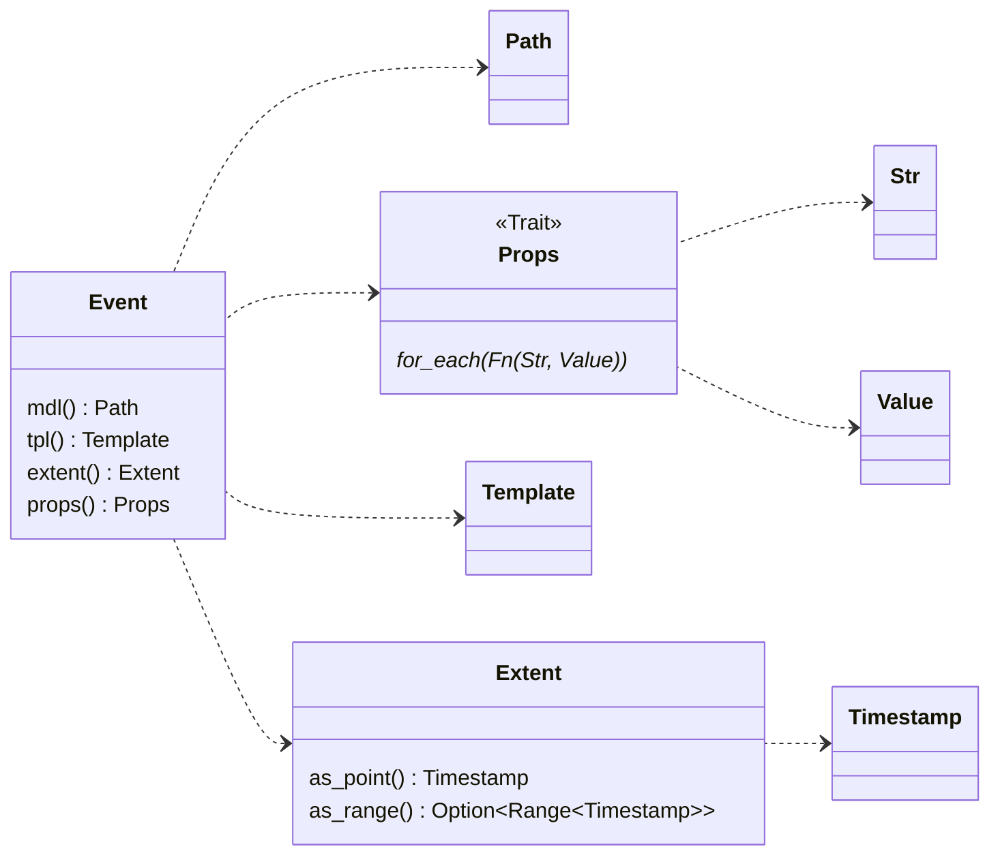
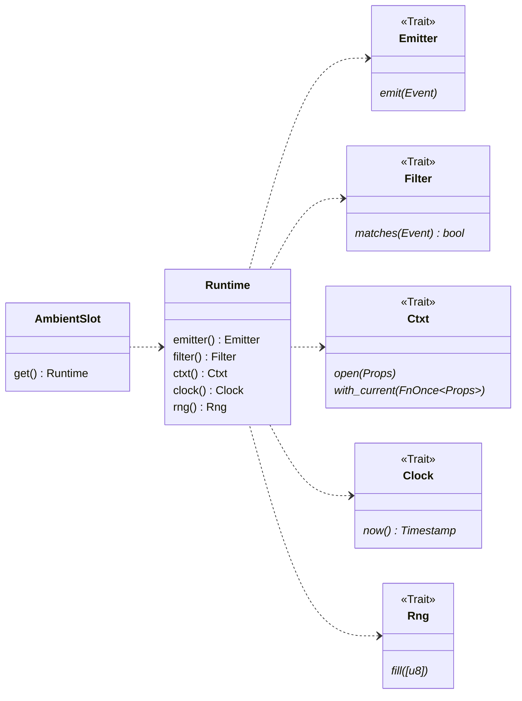
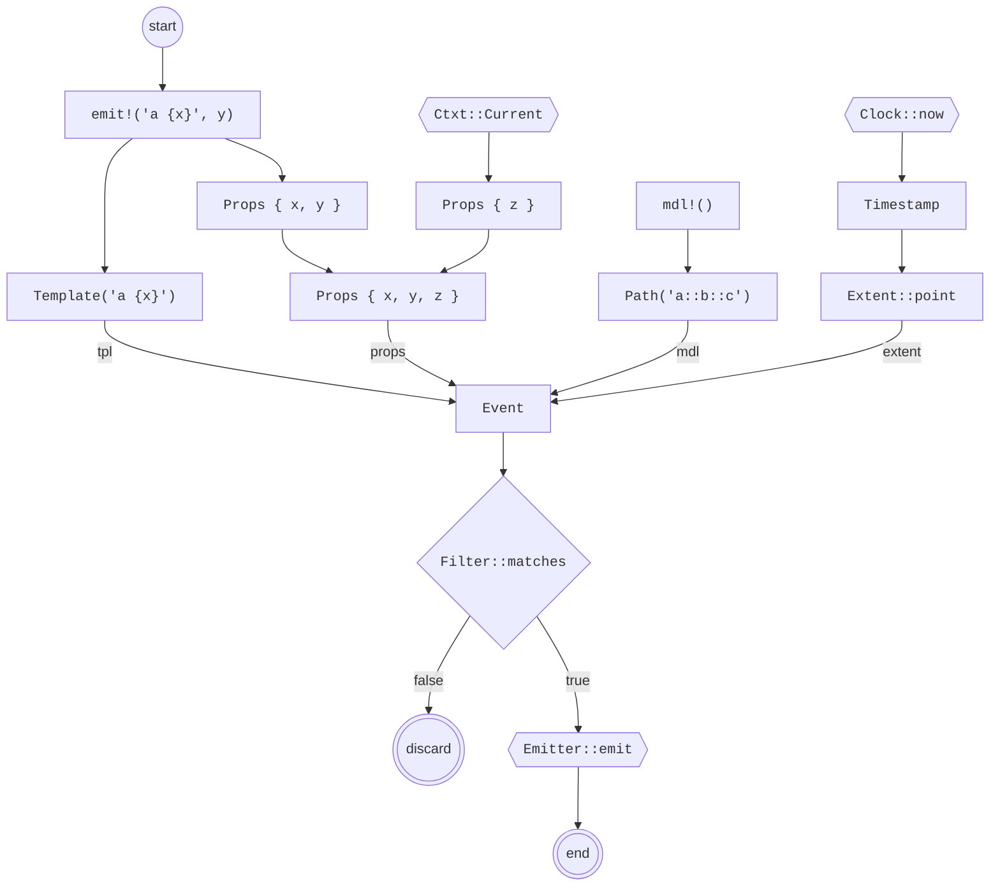
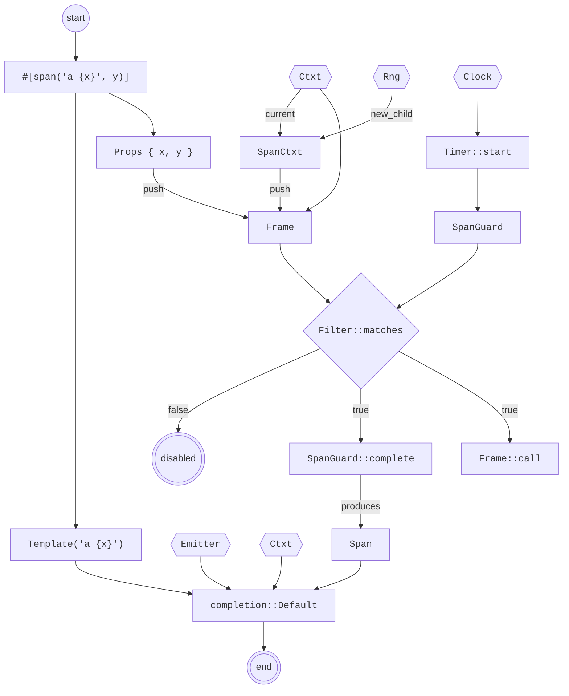

# Architecture

This section describes `emit`'s key components and how they fit together.

## Crate organization

`emit` is split into a few subcrates:

- [`emit`](https://docs.rs/emit/0.11.3/emit/index.html): The main library that re-exports `emit_core` and `emit_macros`. This is the one your applications depend on.
- [`emit_core`](https://docs.rs/emit_core/0.11.3/emit_core/index.html): Just the fundamental APIs. It includes the `shared()` and `internal()` runtimes. The goal of this library is to remain stable, even if macro syntax evolves over time.
- [`emit_macros`](https://docs.rs/emit_macros/0.11.3/emit_macros/index.html): `emit!`, `#[span]`, and other procedural macros.

The `emit` library doesn't implement anywhere for you to send your diagnostics itself, but there are other libraries that do:

- [`emit_term`](https://docs.rs/emit_term/0.11.3/emit_term/index.html): Writes to the console. See [Emitting to the console](../emitting-events/console.md) for details.
- [`emit_file`](https://docs.rs/emit_file/0.11.3/emit_file/index.html): Writes to rolling files. See [Emitting to rolling files](../emitting-events/rolling-files.md) for details.
- [`emit_otlp`](https://docs.rs/emit_otlp/0.11.3/emit_otlp/index.html): Writes OpenTelemetry's wire protocol. See [Emitting via OTLP](../emitting-events/otlp.md) for details.

You can also write your own emitters by implementing the [`Emitter`](https://docs.rs/emit/0.11.3/emit/trait.Emitter.html) trait. See [Writing an Emitter](../for-developers/writing-an-emitter.md) for details.

## Events

[`Event`](https://docs.rs/emit/0.11.3/emit/struct.Event.html)s are the central data type in `emit` that all others hang off. They look like this:

Events include:

- A [`Path`](https://docs.rs/emit/0.11.3/emit/struct.Path.html) for the component that generated them.
- A [`Template`](https://docs.rs/emit/0.11.3/emit/struct.Template.html) for their human-readable description. Templates can also make good low-cardinality identifiers for a specific shape of event.
- An [`Extent`](https://docs.rs/emit/0.11.3/emit/struct.Extent.html) for the time the event is relevant. The extent itself may be a single [`Timestamp`](https://docs.rs/emit/0.11.3/emit/struct.Timestamp.html) for a point in time, or a pair of timestamps representing an active time range.
- [`Props`](https://docs.rs/emit/0.11.3/emit/trait.Props.html) for structured key-value pairs attached to the event. These can be lazily interpolated into the template.

See [Event data model](./events.md) for more details.

## Runtimes

In `emit`, a diagnostic pipeline is an instance of a [`Runtime`](https://docs.rs/emit/0.11.3/emit/runtime/struct.Runtime.html). Each runtime is an isolated set of components that help construct and emit diagnostic events in your applications. It looks like this:

A [`Runtime`](https://docs.rs/emit/0.11.3/emit/runtime/struct.Runtime.html) includes:

- [`Emitter`](https://docs.rs/emit/0.11.3/emit/trait.Emitter.html): Responsible for sending events to some outside observer.
- [`Filter`](https://docs.rs/emit/0.11.3/emit/trait.Filter.html): Responsible for determining whether an event should be emitted or not.
- [`Ctxt`](https://docs.rs/emit/0.11.3/emit/trait.Ctxt.html): Responsible for storing ambient context that's appended to events as they're constructed.
- [`Clock`](https://docs.rs/emit/0.11.3/emit/trait.Clock.html): Responsible for assigning timestamps to events and running timers.
- [`Rng`](https://docs.rs/emit/0.11.3/emit/trait.Rng.html): Responsible for generating unique identifiers like trace and span ids.

An [`AmbientSlot`](https://docs.rs/emit/0.11.3/emit/runtime/struct.AmbientSlot.html) is a container for a `Runtime` that manages global initialization. `emit` includes two built-in ambient slots:

- [`shared()`](https://docs.rs/emit/0.11.3/emit/runtime/fn.shared_slot.html): The runtime used by default when not otherwise specified.
- [`internal()`](https://docs.rs/emit/0.11.3/emit/runtime/fn.internal_slot.html): The runtime used by other runtimes for self diagnostics.

You can also define your own `AmbientSlot`s or use `Runtime`s directly.

## Event construction and emission

When the [`emit!`](https://docs.rs/emit/0.11.3/emit/macro.emit.html) macro is called, an event is constructed using features of the runtime before being emitted through it. This is how it works:

When constructing an event, the runtime provides the current timestamp and any ambient context. When emitting an event, the runtime filters out events to discard and emits the ones that remain.

Once an event is constructed, it no longer distinguishes properties attached directly from properties added by the ambient context.

You don't need to use macros to construct events. You can also do it manually to get more control over the data they contain.

## Span construction and emission

When the [`#[span]`](https://docs.rs/emit/0.11.3/emit/attr.span.html) macro is called, the annotated function is instrumented using features of the runtime before a span representing its execution is emitted through it. This is how it works:

When constructing a span, the runtime generates random trace and span ids from the current ambient context and starts a timer using the clock.

If the runtime filter doesn't match an event representing the start of the span then it's disabled and won't be completed. If it does, an active span guard managing the completion of the span, and a frame containing its ambient trace and span ids are constructed.

At the end of the annotated function, the active span guard is completed, constructing a span event and passing it to its configured completion. From there, the event can be emitted back through the runtime.
