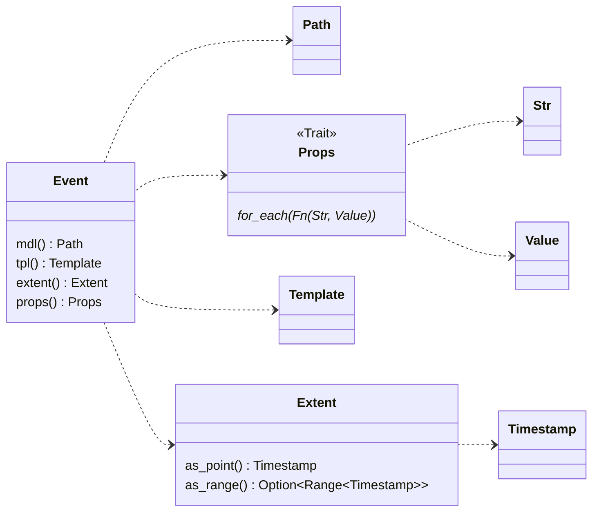
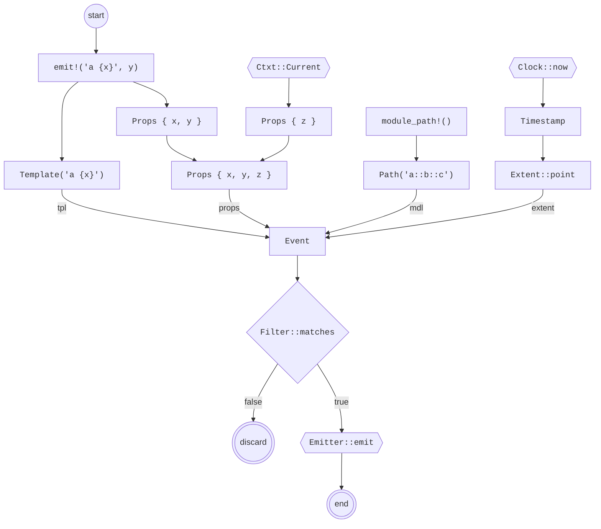

# Event data model

All diagnostics in `emit` are represented as an [`Event`](https://docs.rs/emit/0.11.0-alpha.17/emit/struct.Event.html). The dependency graph of an event looks like this:

Each event is the combination of:

- `mdl` ([`Path`](https://docs.rs/emit/0.11.0-alpha.17/emit/struct.Path.html)): The path of the component that generated the event.
- `tpl` ([`Template`](https://docs.rs/emit/0.11.0-alpha.17/emit/struct.Template.html)): A lazily-rendered, user-facing description of the event.
- `extent` ([`Extent`](https://docs.rs/emit/0.11.0-alpha.17/emit/struct.Extent.html)): The point in time that the event occurred at, or the span of time for which it was active.
- `props` ([`Props`](https://docs.rs/emit/0.11.0-alpha.17/emit/trait.Props.html)): A set of key-value pairs associated with the event.

## Event construction and emission

When the [`emit!`](https://docs.rs/emit/0.11.0-alpha.17/emit/macro.emit.html) macro is called, an [`Event`](https://docs.rs/emit/0.11.0-alpha.17/emit/struct.Event.html) is constructed using features of the runtime before being emitted through it. The following diagram demonstrates this flow in more detail:

In the above diagram, runtime components have angled borders. When constructing an event, the runtime provides the current timestamp and any ambient context. When emitting an event, the runtime filters out events to discard and emits the ones that remain.

See [Architecture](./architecture.md) for details on what these components are.

## Extensions

Well-known props and `evt_kind`.

## Value data model

`serde`, `sval` -> `Value` data model

## Extents and timestamps

Points vs ranges
