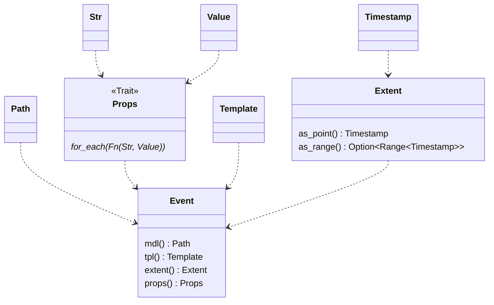

# Event data model

```mermaid
classDiagram
    Timestamp ..> Extent

    Str ..> Props
    Value ..> Props

    class Props {
        for_each(Fn(Str, Value))*
    }

    <<Trait>> Props

    Path ..> Event
    Props ..> Event
    Template ..> Event

    class Extent {
        as_point() Timestamp
        as_range() Option~Range~Timestamp~~
    }

    Extent ..> Event

    class Event {
        mdl() Path
        tpl() Template
        extent() Extent
        props() Props
    }

    click Event href "https://docs.rs/emit/0.11.0-alpha.17/emit/struct.Event.html"
    click Timestamp href "https://docs.rs/emit/0.11.0-alpha.17/emit/struct.Timestamp.html"
    click Extent href "https://docs.rs/emit/0.11.0-alpha.17/emit/struct.Extent.html"
    click Str href "https://docs.rs/emit/0.11.0-alpha.17/emit/struct.Str.html"
    click Value href "https://docs.rs/emit/0.11.0-alpha.17/emit/struct.Value.html"
    click Props href "https://docs.rs/emit/0.11.0-alpha.17/emit/trait.Props.html"
    click Template href "https://docs.rs/emit/0.11.0-alpha.17/emit/struct.Template.html"
    click Path href "https://docs.rs/emit/0.11.0-alpha.17/emit/struct.Path.html"
```

## Value data model

`serde`, `sval` -> `Value` data model

## Extents and timestamps

Points vs ranges
